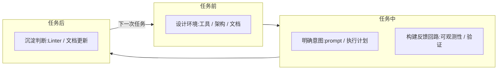

---

## title: OpenAI 的 Harness Engineering

date: 2024-05-03
tags: [Harness Engineering, OpenAI, Agent]

# OpenAI 的 Harness Engineering

> 原文：[Engineering in an agent-first world with Codex](https://openai.com/zh-Hans-CN/index/harness-engineering/)
> 作者：Ryan Lopopolo，2026年2月11日

---

## 第一章：读懂这篇文章的核心脉络

读这篇文章之前，我以为它会讲 Codex 有多强。读完之后发现，它其实是在讲工程师应该怎么变。

OpenAI 的团队做了一个极端实验：五个月，三名工程师，百万行代码，没有一行是人写的。但文章的重点不是这个数字，而是他们在这个过程里发现的一件事——

> "早期进展比我们所预期的要慢，而这并不是因为 Codex 不具备相应的能力，而是因为环境的规范不够明确。"

这句话值得反复看。同样的模型，换一个环境，结果天差地别。这直接推翻了一个我之前默认的假设：Agent 产物质量不好，是模型的问题。

其实不是。**模型能力决定的是下限，Harness Engineering 决定的是上限。**

模型能力是你买来的，Harness Engineering 是你做出来的。前者是外部条件，后者才是工程师真正能施加影响的地方。这个认知转变，是理解这篇文章所有内容的基础。

### 什么是 Harness Engineering？

"Harness"在工程语境里的含义是"驾驭"或"利用"——不是让能力更强，而是让已有的能力被有效地组织和使用。Harness Engineering 就是这个意思：**一套专门解决"如何为 Agent 构建有效工作环境"的工程方法论。**

它的核心主张是：Agent 的产出质量，不只取决于模型本身，更取决于它工作的那套环境——架构约束是否清晰、知识文档是否完整、工具链是否到位、反馈机制是否闭环。这些东西不会自动存在，需要工程师去建。

这个定义有一个直接的推论：Harness Engineering 的产出不是代码，而是**让 Agent 能产出好代码的那套结构**。工程师的工作对象，从代码本身变成了代码生产的基础设施。

### "人类掌舵。智能体执行。"

理解了 Harness Engineering 是什么之后，文章开篇那句"人类掌舵，智能体执行"就不再像口号了——它是对这套方法论背后分工逻辑的精确描述。

"掌舵"不等于"监督"。监督是事后的：等 Agent 做完，人来检查对不对。掌舵是事前的：在 Agent 开始工作之前，人已经把目标、边界、约束全都定好并编码进环境了。人类不参与执行，但对结果负全责；介入的时机是任务开始之前，而不是执行过程中。

这个分工在 OpenAI 的实验里体现得非常彻底。他们的工程师几乎完全通过 prompt 与系统交互——描述任务，运行 Agent，允许它打开 PR。人类不写代码，甚至越来越少地审查代码，最终把大部分审查工作也交给了 Agent 对 Agent 来完成。人类只在一种情况下介入：**需要判断的时候**。

这里有一个关键的认知转变：在传统工程里，"做"和"判断"是混在一起的——工程师边写代码边做判断。在 Agent 驱动的工程里，两者被彻底分离——Agent 负责"做"，人类只负责"判断"。而判断的结果，不是口头指令，而是被编码进环境里的约束、文档和工具。

这个分工成立的前提，也是它最脆弱的地方：**人类必须把意图表达得足够清晰，Agent 才能正确执行。** 表达不清晰，Agent 不会停下来问你，它会自己推断——而推断出来的结果，往往不是你想要的。这就是 Harness Engineering 真正要解决的问题所在。

### 工程师的新职责：视野从"写什么"转向"建什么"

明确了"人类掌舵"的分工之后，下一个问题自然是：掌舵具体意味着做哪些事？

原文在"重新定义工程师的角色"这一节给出了答案，但它的表述方式值得注意——它没有列出一张新的任务清单，而是描述了一种**工作重心的迁移**：

> "工程师工作的重点转向了系统、架构和杠杆作用。"

这句话里有三个词，每个都有具体含义：

- **系统**，指的是 Agent 运行所依赖的整套基础设施——工具链、可观测性、CI 配置、知识文档，这些东西共同构成了 Agent 的工作环境。
- **架构**，指的是代码库的结构和约束，它决定了 Agent 在什么边界内工作、能走多远、会不会走偏。
- **杠杆作用**，指的是工程师的每一次投入能撬动多大的 Agent 产出——一条 Linter 规则，可能影响之后所有生成代码的质量；一份写清楚的设计文档，可能让 Agent 在接下来几周都不需要人类介入。

原文还描述了一个具体的工作模式：当事情进展不顺利时，解决方案几乎再也不是"再努力一点"，而是追问——

> "究竟还需要什么样的能力，我们又该如何让这个能力对智能体来说既清晰可读又可强制执行？"

这个追问方式本身就是工程师新职责的缩影。遇到问题，不是自己上手修，而是问：Agent 为什么做不好？是缺工具？是文档不清楚？是约束没有到位？找到根因，把它编码进环境，让 Agent 下次自己能处理。

具体落到工程实践层面，应该分别对应几种行动：

**设计环境：**是任务开始之前的前置投入，工具、抽象层、架构约束、知识文档，全都要提前就位。这是一次性的重投入，但它决定了 Agent 能在多大的空间里有效工作，以及能工作多久不需要人类介入。

**明确意图和构建反馈回路：**是任务进行中的保障，意图决定 Agent 理解的任务边界，反馈回路决定 Agent 能不能自己发现偏差并修正。两者共同保证 Agent 在执行过程中不会走偏，以及走偏了能自己找回来。

**沉淀判断：**是任务结束后的增值动作，每一次人类介入、每一条 Review 意见、每一个生产 Bug，都是一次把隐性判断转化为显性约束的机会。这一步做得越好，下一次 Agent 需要人类介入的情况就越少。

Harness Engineering，就是通过各种具体的工程手段去践行这些职责，最终让 Agent 的产出持续达标——不是靠盯着它，而是靠建好它工作的地基。

---

## 第二章：Harness Engineering 的思想全景

把文章里的工程思想梳理了一遍，按四个职责维度分类如下：

| 职责维度 | OpenAI原文核心思想 | 一句话解释 |
| --- | --- | --- |
| **设计环境** | 提高应用程序的可读性 | 通过让应用程序的UI、日志和应用指标等内容对Agent直接可读，从而为智能体增加更多功能 |
| **设计环境** | 我们将代码仓库设为记录系统 | 给Agent一张地图，而不是一本庞杂的说明书，AGENTS.md作为内容目录而非规则手册 |
| **设计环境** | 目标是智能体的可读性 | 让智能体能直接从代码仓库推理出完整的业务领域，将代码、Markdown、模式、可执行计划等放到仓库 |
| **明确意图** | 规范架构与品味 | 明确边界和规则，通过强制执行不变量而非微观管理实施过程，令智能体快速交付且不削弱基础 |
| **构建反馈回路** | 吞吐量改变了合并的理念 | Agent吞吐量远超人类审查速度时，等待成本>纠错成本，最小化阻塞门控，偶发失败通过重跑解决 |
| **构建反馈回路** | "智能体生成"实际上意味着什么 | 人类提供验证结果和反馈，Agent自己编写修复，工作的抽象层次从代码转向判断和标准 |
| **沉淀判断** | 不断提高的自主水平 | 只有在仓库具备具体结构和工具支撑时，才能期望Agent完成端到端地驱动功能开发 |
| **沉淀判断** | 熵与垃圾收集 | 将人类主观意见编码为机械规则，建立循环清理流程，Agent定期运行后台任务完成代码优化重构 |

---

### 2.1 提高应用程序的可读性

**OpenAI原文核心思想**

随着代码吞吐量的增加，人工QA能力成为瓶颈。由于人类的时间和注意力是固定的限制因素，OpenAI团队通过让应用程序的UI、日志和应用指标等内容对Codex直接可读，从而为智能体增加更多功能。

**设计哲学**

验证工作如果必须依赖人来完成，Agent吞吐量再高也没用——人反而成了新的瓶颈。但当Agent能直接读取运行时状态时，它就从"写代码的"变成了"解决问题的"。它可以自己复现Bug、验证修复、确认性能指标，不需要工程师在旁边当翻译。原文提到单次Codex运行可以持续工作超过六个小时——通常是在人类睡眠的时候。这就是可观测性带来的效果：Agent在无人监督的情况下也能自主推进。

**工程实践**

令应用程序可以根据git worktree启动，Codex为每次更改驱动一个独立实例，将Chrome DevTools协议接入智能体运行时，创建用于处理DOM快照、屏幕截图和导航的技能。日志、指标和追踪记录通过临时可观测性栈展示给Codex，每个工作树对应独立的临时栈，任务完成后自动删除，互不干扰。

---

### 2.2 我们将代码仓库设为记录系统

**OpenAI原文核心思想**

给Codex的是一张地图，而不是一本1,000页的说明书。AGENTS.md不再被视为百科全书，而是作为内容目录。代码仓库的知识库位于结构化的docs/目录中，被当作记录系统来使用。

**设计哲学**

OpenAI尝试过"一个大型AGENTS.md"方法，结果失败了。情境是一种稀缺资源——一个巨大的指令文件会挤掉任务、代码和相关文档；过多的指导反而变得无效，当一切都"重要"时，一切都不重要了；它会立即腐烂，一本庞杂的手册会变成陈旧规则的坟场；它很难核实，单个blob不适合机械检查，漂移不可避免。给Agent一张地图，告诉它"下一步去哪里找"，比把所有信息一次性堆给它要有效得多。

**工程实践**

一份简短的AGENTS.md（约100行）被注入到情境中，主要用作地图并指向其他地方更深层次的真实信息来源。设计文档已被编目和索引，架构文档提供域和包分层的顶层地图。计划被视为一流的工件，复杂工作记录在执行计划中，附带进度和决策日志，活跃计划、已完成计划和已知技术债务均进行版本控制并集中存放。专职linter和CI作业验证知识库更新状况和交叉链接完整性，doc-gardening Agent定期扫描过时文档并发起修复PR。

---

### 2.3 目标是智能体的可读性

**OpenAI原文核心思想**

让智能体能够直接从代码仓库推理出完整的业务领域。代码、Markdown、模式、可执行计划、产品原则、工程规范等信息都应放到仓库内版本化，而非存于外部系统。

**设计哲学**

由于代码仓库完全由智能体生成，OpenAI首先针对Codex的可读性进行了优化。Agent在运行时无法在情境中访问的任何内容都是不存在的——存储在Google Docs、聊天记录或人们头脑中的知识都无法被系统访问。代码仓库本地的、已版本化的工件就是它所能看到的全部。那次让团队在架构模式上达成一致的Slack讨论，如果智能体无法发现它，它就像迟了三个月入职的新员工，对整件事一无所知。工程师必须养成一种新习惯：每次做了重要决定，都要问一句"Agent能看到这个决定吗"。

**工程实践**

将Slack讨论中的架构共识提炼为design-docs；将产品brief转化为product-specs；将工程偏好和团队文化写进PRODUCT_SENSE.md和DESIGN.md。在技术选型上，优先选择训练集中出现频率高、API稳定、行为可预测的库。在某些情况下，直接在仓库内实现所需功能的子集，让Agent能完整推理其行为，而不是依赖不透明的上游实现。

---

### 2.4 规范架构与品味

**OpenAI原文核心思想**

明确边界和规则，通过强制执行不变量而非对实施过程进行微观管理，令智能体能够快速交付，而且不会削弱基础。

**设计哲学**

仅靠文档本身无法保持完全由智能体生成的代码库的连贯性。通过强制执行不变量，而非微观管理实施过程，智能体能够在严格边界和可预测结构的环境中高效工作。Agent会忠实地复制代码库里已有的一切模式——好的坏的都一起放大。如果架构一开始就松散，混乱会以指数级扩散。约束不是在限制Agent，而是在给它提供一个可以快速移动的稳定地基。人类品味一旦被捕捉进工具，就会对之后每一行生成的代码持续生效。

**工程实践**

每个业务域划分为固定的依赖层次，依赖方向经过严格验证，仅允许有限的一组边。这些约束通过自定义Linter和结构测试机械地强制执行，Linter本身也由Codex生成。Linter的错误信息里直接嵌入修复指令，Agent触发报错时可直接读取修复方案。将团队认可的品味偏好编码为仓库内的机械规则，例如优先使用共享工具包而非手工辅助函数。

---

### 2.5 吞吐量改变了合并的理念

**OpenAI原文核心思想**

Agent吞吐量远超人类审查速度时，等待成本大于纠错成本，最小化阻塞门控，测试偶发失败通过重跑解决而非无限期阻塞。

**设计哲学**

传统的严苛合并门控逻辑是：修复Bug的成本很高，所以要在合并前尽量卡住问题。这在人工编码、低吞吐量的场景下是合理的。但当Agent的代码生成速度远超人类审查速度时，成本结构变了——等待的成本高过了纠错的成本。一个PR卡在那里等审查，是在消耗时间；而如果合并后发现问题，Agent可以很快出一个修复PR。快速迭代比谨慎等待更划算。这个结论成立的前提是Linter、结构测试、可观测性这些兜底机制都已经到位了。快速合并不是放弃质量，而是把质量保障的重心从"合并前审查"移到了"设计环境阶段的前置投入"。

**工程实践**

该代码仓库在运行过程中尽量减少阻塞合并门控，PR生命周期保持短促。测试偶发失败通常通过后续重跑解决，而不是无限期地阻碍进展。越来越多的审查工作由Agent对Agent完成，人类的审查精力集中在需要判断的地方。

---

### 2.6 "智能体生成"实际上意味着什么

**OpenAI原文核心思想**

人类始终参与其中，但工作的抽象层次与过去不同。人类提供验证结果和反馈，Agent自己编写修复。

**设计哲学**

当说代码库是由智能体生成时，指的是整个代码库——产品代码与测试、CI配置和发布工具、内部开发者工具、文档和设计历史、评估框架、审阅评论和回复、管理代码仓库本身的脚本、生产仪表板定义文件。人类始终参与其中，但工作的抽象层次与过去不同：我们优先处理工作，将用户反馈转化为验收标准，并对结果进行验证。当智能体遇到困难时，我们将其视为一个信号——识别缺失的内容（工具、指导与约束、文档）并将其反馈到代码仓库中，始终由Codex自己编写修复。

**工程实践**

智能体直接使用标准开发工具，拉取审查反馈、在行内回复、推送更新，并经常自主压缩并合并PR。人类通过prompt与系统交互，描述任务、运行智能体、允许它打开PR。Codex在本地审核其自身的更改，请求额外的智能体审查，对任何反馈做出响应，直到所有智能体审核人员都满意为止。

---

### 2.7 不断提高的自主水平

**OpenAI原文核心思想**

只有在仓库具备具体结构和工具支撑时，才能期望Agent完成端到端地驱动功能开发。

**设计哲学**

随着越来越多的开发环节被直接编码到系统中——包括测试、验证、审查、反馈处理和恢复——该代码仓库跨过了一个重要门槛：Codex能够端到端地驱动一个新功能。但原文也明确指出，此行为在很大程度上取决于此代码仓库的具体结构和工具，不应在没有类似投入的情况下假定它可以泛化。端到端的自主能力不是一开始就有的，是通过持续把验证能力编码进系统一步步建出来的。这个过程是一个信号系统：当Agent遇到困难时，解决方案基本上再也不是"再努力一点"，而是追问"究竟还需要什么样的能力，我们又该如何让这个能力对智能体来说既清晰可读又可强制执行"。

**工程实践**

给定一个prompt，智能体现在可以：验证代码库当前状态→复现已报告漏洞→录制故障视频→实施修复→运行应用程序验证修复→录制解决方案视频→打开PR→响应智能体和人类反馈→检测并修复构建故障→仅在需要判断时交由人工处理→合并更改。整个过程中人类的介入仅限于需要真正判断的时候。

---

### 2.8 熵与垃圾收集

**OpenAI原文核心思想**

将带有人类主观意见的机械规则直接编码到代码仓库，并建立了一个循环清理流程，定期运行Agent后台任务完成代码优化和重构。

**设计哲学**

完全自主的智能体也引入了新的问题——Codex会复现代码库中已存在的模式，甚至包括那些不均衡或不够理想的模式。这是一种隐性的熵增，速度会随着吞吐量加快。OpenAI最开始用人工清理，每周五花一天时间处理"AI残渣"，很快发现这根本跑不赢生成速度。解法是让垃圾回收本身也自动化：把"好的模式应该是什么样"编码为机械规则，然后让Agent定期去扫描偏差、发起修复PR。技术债务就像高息贷款——不断地以小额贷款方式偿还债务，总比让债务不断累积再痛苦地一次解决要好。

**工程实践**

将团队认可的"黄金原则"编码为仓库内的机械规则——这些是带有主观意见的机械规则，旨在保持代码库的可读性和一致性。例如：更倾向于使用共享实用程序包而非手工辅助工具；不会使用"YOLO式"探测数据，而是验证边界或依赖类型化SDK。定期运行一组后台Codex任务，扫描偏差、更新质量等级、发起有针对性的重构PR，其中大多数可在一分钟内完成审查并自动合并。doc-gardening Agent持续扫描过时文档，确保仓库内的知识始终与实际代码行为保持一致。